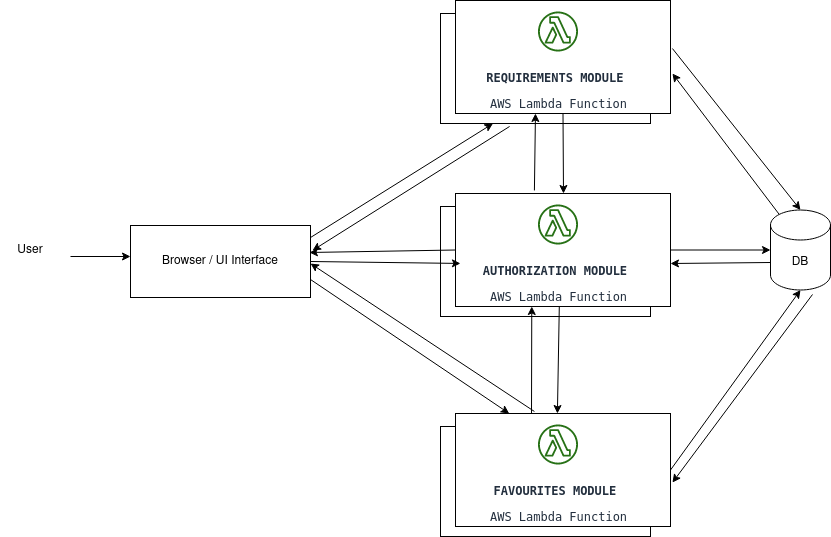

# Scalability Document

Scalability is generally defined as the measure of a system’s ability to increase or decrease in performance and the number of users a system can handle at a given time.

We have explored the following options to scale our application while also trying to maintain availability:

For the initial scaling, we tried publishing our application by using a cloud architecture. We deployed our application on an AWS EC2 server and enable auto scaling to this. As the number of users increase the server automatically scales up vertically. This can go up easily for a 1000 users at once. But it has a few limitations. Firstly, it has a single point of failure. If the server fails, the whole website goes down. Secondly, the costs are also generally high as the scaling is vertical. And finally, there is a limit until which we can scale our server vertically.

Considering the above limitations, we tried deploying our application to a serverless framework in AWS called AWS Lambda. We deployed our application to AWS Lambda using Zappa using our free tier credits on AWS. This solution solved our problem of limited vertical scaling and single point of failure. But we still have another issue left. We are depending on an external api to get weather forecast which might have a delay sometimes. Since lambda functions have a limitation in terms of execution time, this might cause a failure to our system. But the overall application can easily scale up to 1000 users per second. 

So, we finally came up with a design this issue too. Owing to the time limitations, we could not try to change the architecture and implement it. But we did our best research to evaluate this option. We can break down our application into separate modules, decouple them as much as possible and deploy them as serverless modules in a micro-services architecture. We have the following modules:

1. **Authentication:** Since this is a one time thing per session, we need not run this all the time and we wanted this to be independent of the other modules. We don’t have a strong time constraint too. So we plan to have this particular module deployed as a serverless application. Since it is serverless, we get billed only when a request is received and not for the availability. We can send the generated token to client and the client stores this token in the browser cache and is sent in every request to the backend.
2. **Recommendations and Weather Forecast:** The recommendations module is tightly coupled with the weather module as it needs inputs from the weather module to give recommendations. So we tried to put these two modules in a single service. We might need to cache user preferences to make the experience faster. So, we are saving these preferences in our browser cache.
3. **Favourites:** This is independent of the other modules and can directly operate with data received from the client(browser). So this can completely be operated an independent module. This can also be a serverless module as this need not be available all the time .

In most of the applications, DB is generally the bottle neck in terms of scaling. We are using a server based relational database, MySQL database for now since our db requirements are pretty low at this point of time. We can easily migrate it to SQLite DB which is a serverless DB and this will solve the issue of DB bottle neck. The architecture is as follows:

Considering all the points above, we strongly believe that this can very easily scale to a 1000 users per second while maintaining good availability.

